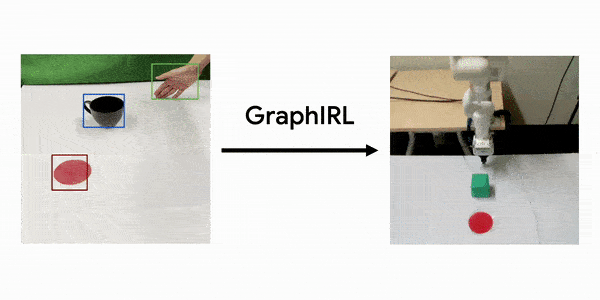
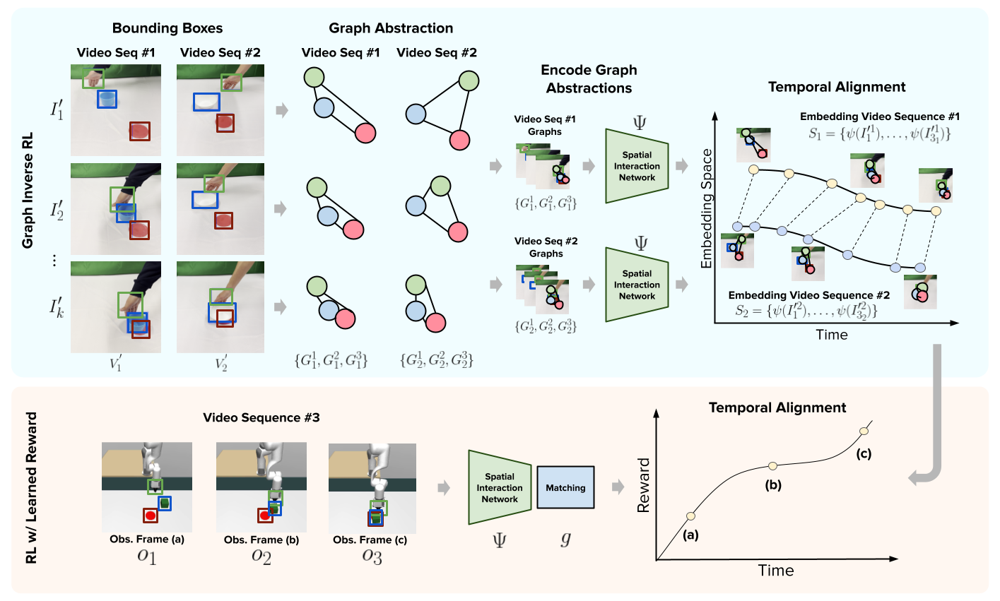

# Graph Inverse Reinforcement Learning

Original PyTorch implementation of **GraphIRL** from

[Graph Inverse Reinforcement Learning from Diverse Videos](https://arxiv.org/abs/2207.14299) by

[Sateesh Kumar](https://sateeshkumar21.github.io/), [Jonathan Zamora](https://jonzamora.dev/)\*, [Nicklas Hansen](https://nicklashansen.github.io/)\*, [Rishabh Jangir](https://jangirrishabh.github.io/), [Xiaolong Wang](https://xiaolonw.github.io/)


<p align="center">
  <br><br>
   <a href="https://arxiv.org/abs/2207.14299">[Paper]</a>&emsp;<a href="https://sateeshkumar21.github.io/GraphIRL">[Website]</a>
</p>


## Method

**GraphIRL** is a self-supervised method for learning a visually invariant reward function directly from a set of diverse third-person video demonstrations via a graph abstraction. Our framework builds an object-centric graph abstraction from video demonstrations and then learns an embedding space that captures task progression by exploiting the temporal cue in the videos. This embedding space is then used to construct a domain invariant and embodiment invariant reward function which can be used to train any standard reinforcement learning algorithm.

<p align="center">
  
</p>


## Citation

If you use our method or code in your research, please consider citing the paper as follows:

```
@article{kumar2022inverse,
      title={Graph Inverse Reinforcement Learning from Diverse Videos},
      author={Kumar, Sateesh and Zamora, Jonathan and Hansen, Nicklas and Jangir, Rishabh and Wang, Xiaolong},
      journal={arXiv preprint arXiv:2207.14299},
      year={2022}
}
```

## Instructions

We assume you have installed [MuJoCo](http://www.mujoco.org) on your machine. You can install dependencies using `conda` and our `install_env.sh` script:

```
conda env create -f environment.yaml
conda activate graphirl
bash scripts/install_env.sh
```

After installing dependencies, you can learn a GraphIRL Reward Function by running:

```
bash scripts/train_graphirl.sh
```

# License & Acknowledgements

GraphIRL is licensed under the MIT license. [MuJoCo](https://github.com/deepmind/mujoco) is licensed under the Apache 2.0 license. We thank the [XIRL](https://x-irl.github.io/) authors for open-sourcing their codebase to the community, our work is built on top of their engineering efforts.